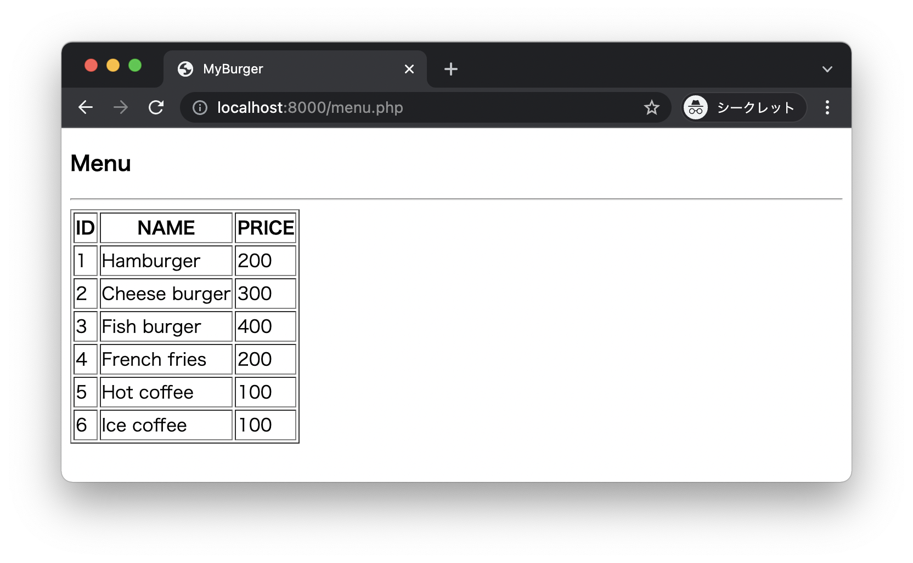

# Burger shop 2

* 次の `menu.csv` ファイルを準備します。

```csv
1,Hamburger,200
2,Cheese burger,300
3,Fish burger,400
4,French fries,200
5,Hot coffee,100
6,Ice coffee,100
```

* `menu.csv` ファイルを参照してメニュー画面を表示します。


