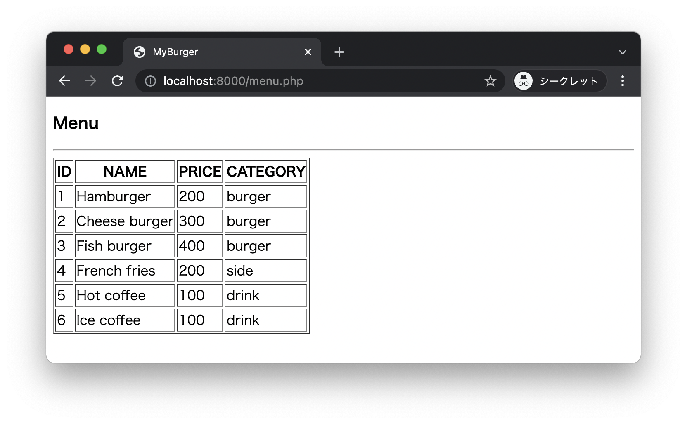

# Burger shop 2

* 次の `menu.csv` ファイルを準備します。

```csv
1,Hamburger,200,1
2,Cheese burger,300,1
3,Fish burger,400,1
4,French fries,200,2
5,Hot coffee,100,3
6,Ice coffee,100,3
```

* 次の `category.csv` ファイルを準備します。

```
1,burger
2,side
3,drink
```

* `menu.csv` ファイル、`category.csv` ファイルを参照してメニュー画面を表示します。


