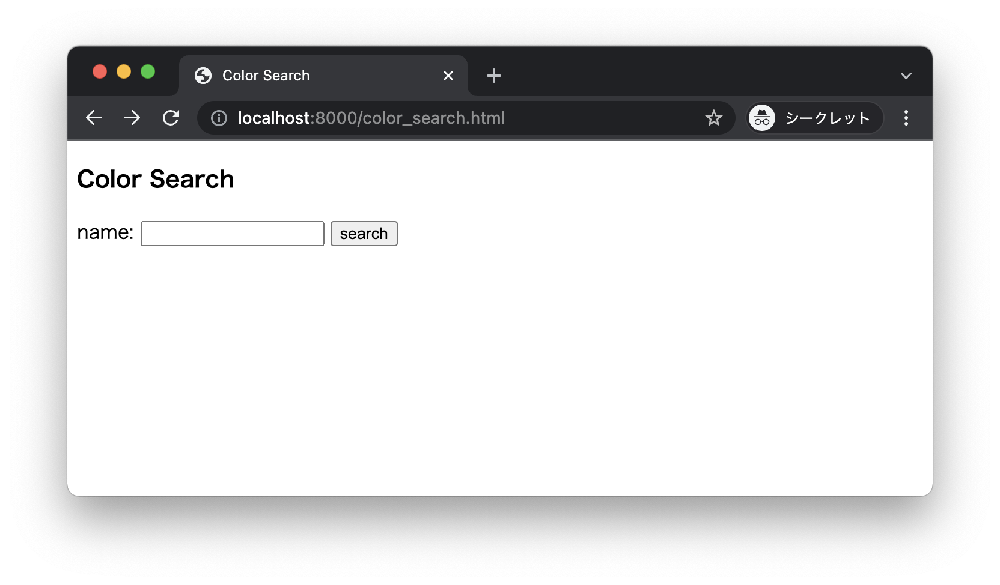
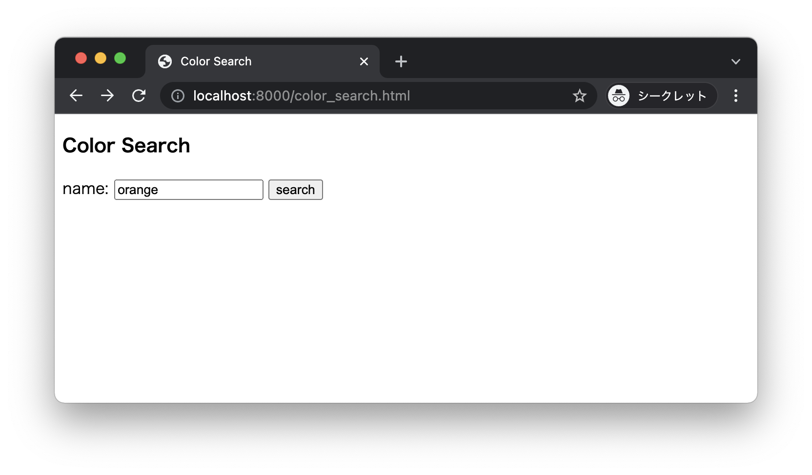
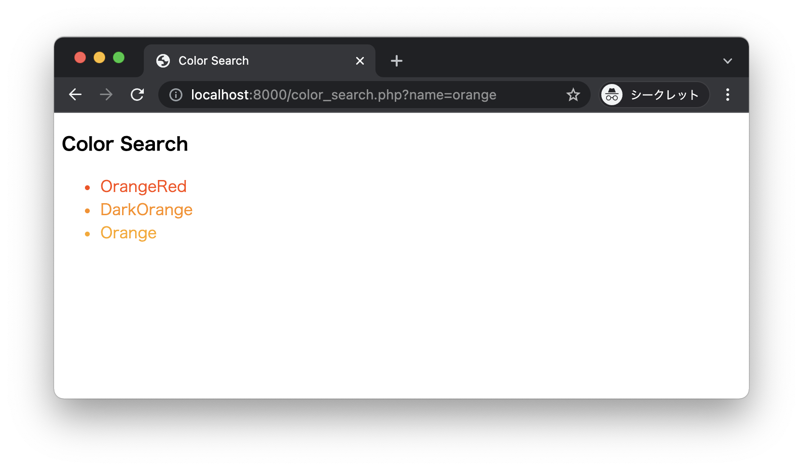

# Color Search App

* カラー検索画面を表示します。



* color name を入力して search ボタンをクリックします。



* 検索結果が表示されます。



## カラーデータ

```
MediumVioletRed
DeepPink
PaleVioletRed
HotPink
LightPink
Pink
DarkRed
Red
Firebrick
Crimson
IndianRed
LightCoral
Salmon
DarkSalmon
LightSalmon
OrangeRed
Tomato
DarkOrange
Coral
Orange
DarkKhaki
Gold
Khaki
PeachPuff
Yellow
PaleGoldenrod
Moccasin
PapayaWhip
LightGoldenrodYellow
LemonChiffon
LightYellow
Maroon
Brown
SaddleBrown
Sienna
Chocolate
DarkGoldenrod
Peru
RosyBrown
Goldenrod
SandyBrown
Tan
Burlywood
Wheat
NavajoWhite
Bisque
BlanchedAlmond
Cornsilk
DarkGreen
Green
DarkOliveGreen
ForestGreen
SeaGreen
Olive
OliveDrab
MediumSeaGreen
LimeGreen
Lime
SpringGreen
MediumSpringGreen
DarkSeaGreen
MediumAquamarine
YellowGreen
LawnGreen
Chartreuse
LightGreen
GreenYellow
PaleGreen
Teal
DarkCyan
LightSeaGreen
CadetBlue
DarkTurquoise
MediumTurquoise
Turquoise
Aqua
Cyan
Aquamarine
PaleTurquoise
LightCyan
Navy
DarkBlue
MediumBlue
Blue
MidnightBlue
RoyalBlue
SteelBlue
DodgerBlue
DeepSkyBlue
CornflowerBlue
SkyBlue
LightSkyBlue
LightSteelBlue
LightBlue
PowderBlue
Indigo
Purple
DarkMagenta
DarkViolet
DarkSlateBlue
BlueViolet
DarkOrchid
Fuchsia
Magenta
SlateBlue
MediumSlateBlue
MediumOrchid
MediumPurple
Orchid
Violet
Plum
Thistle
Lavender
MistyRose
AntiqueWhite
Linen
Beige
WhiteSmoke
LavenderBlush
OldLace
AliceBlue
Seashell
GhostWhite
Honeydew
FloralWhite
Azure
MintCream
Snow
Ivory
White
Black
DarkSlateGray
DimGray
SlateGray
Gray
LightSlateGray
DarkGray
Silver
LightGray
Gainsboro
```

> ファイルにコピーして利用してください。