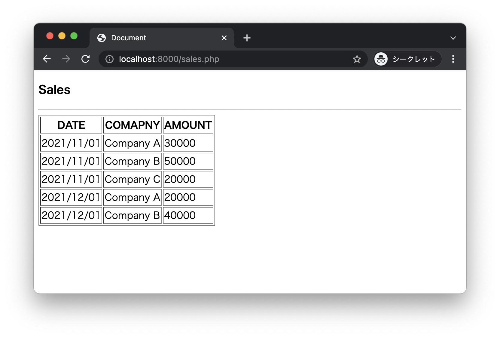

# Sales App

* 売上一覧画面を表示します。



## データ1 - 二次元配列

```
$sales = [
    ["2021/11/01", "Company A", 30000],
    ["2021/11/01", "Company B", 50000], 
    ["2021/11/01", "Company C", 20000], 
    ["2021/12/01", "Company A", 20000], 
    ["2021/12/01", "Company B", 40000] 
];
```

---

## データ2 - CSV

### sales.csv

```
2021/11/01,Company A,30000
2021/11/01,Company B,50000
2021/11/01,Company C,20000
2021/12/01,Company A,20000
2021/12/01,Company B,40000
```

---

## データ3 - table

### sales table

```
create table sales(
    id int primary key,
    date date,
    company varchar(100),
    amount int
);
insert into sales (id, date, company, amount) values (1, '2021/11/01', 'Company A', 30000);
insert into sales (id, date, company, amount) values (2, '2021/11/01', 'Company B', 50000);
insert into sales (id, date, company, amount) values (3, '2021/11/01', 'Company C', 20000);
insert into sales (id, date, company, amount) values (4, '2021/12/01', 'Company A', 20000);
insert into sales (id, date, company, amount) values (5, '2021/12/01', 'Company B', 40000);
```

### 確認用

```
sqlite> select * from sales;
1|2021/11/01|Company A|30000
2|2021/11/01|Company B|50000
3|2021/11/01|Company C|20000
4|2021/12/01|Company A|20000
5|2021/12/01|Company B|40000
sqlite> 
```
